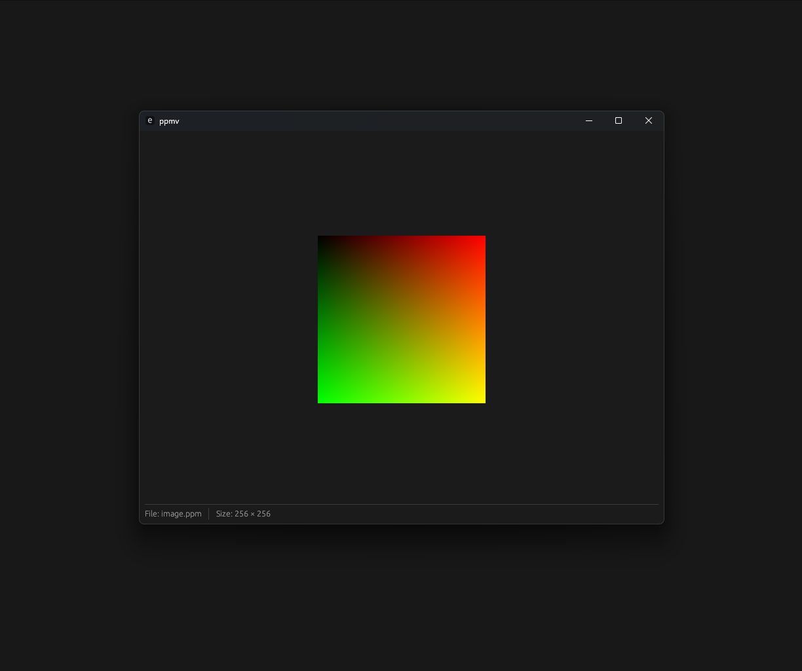

# PPMV
A simple and lightweight PPM (Portable Pixmap) image viewer built with Rust and egui.
Currently supports only P3 .ppm files (UTF-8).

## Installation
Step -1:
     
    `git clone https://github.com/notenderdreams/ppm-viewer.git`
     
 Step-2:
     
    `cd ppm-viewer`
     
Step-3:
     
    `cargo install --path .`

## Usage
`ppmv <file.ppm>`